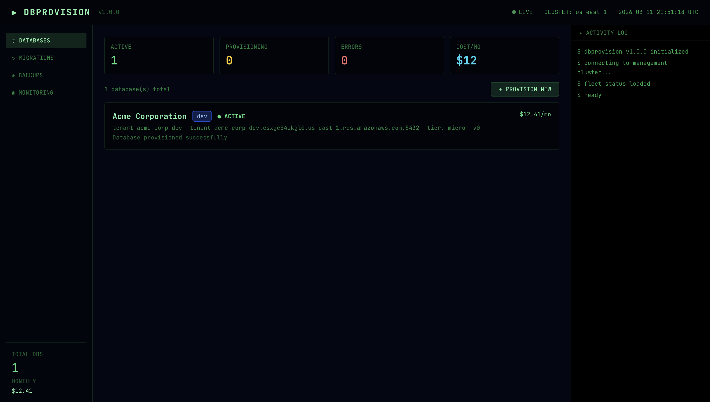
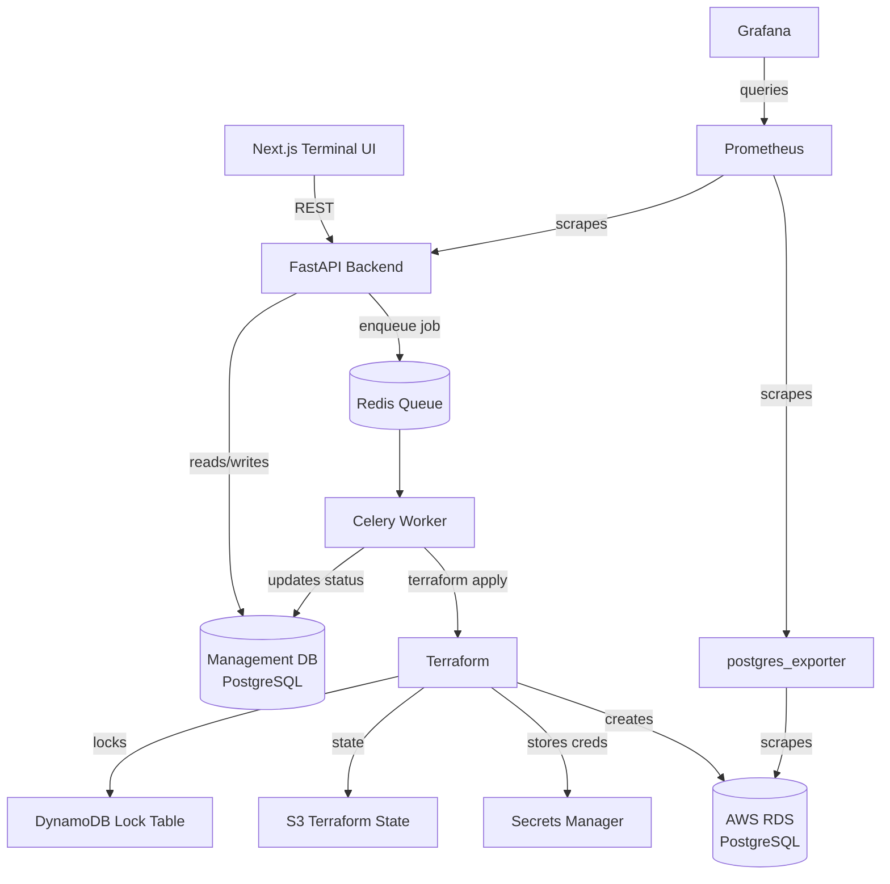
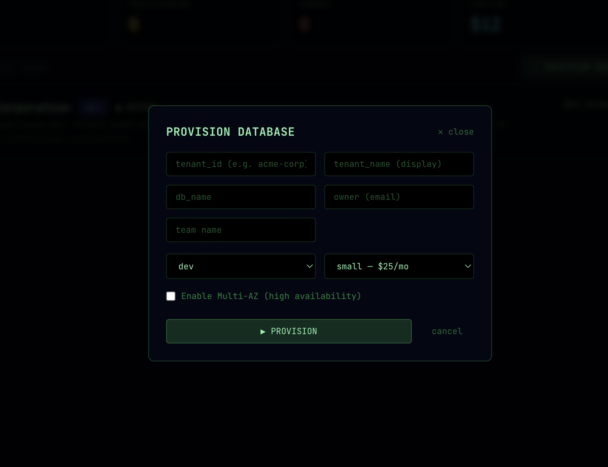
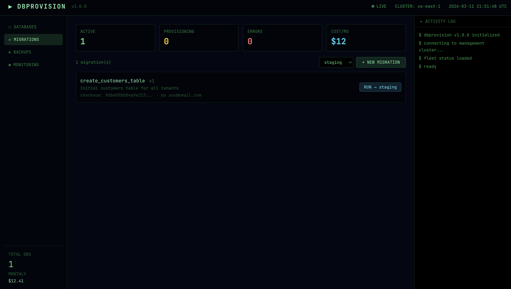
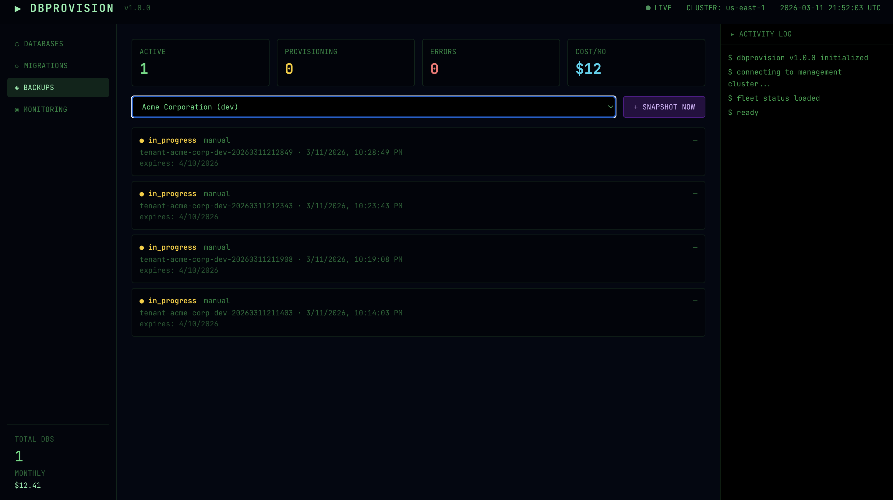
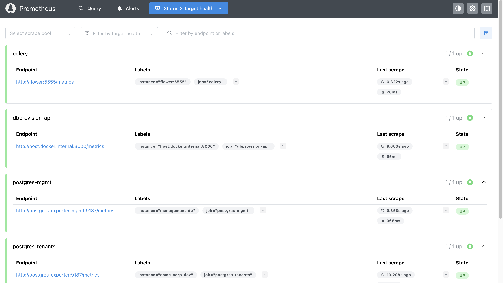
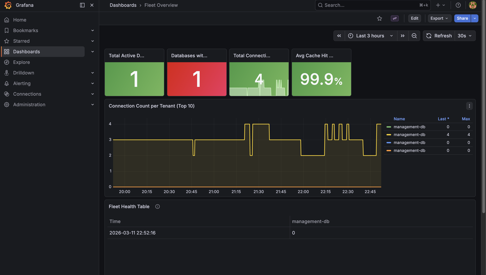

# DBProvision — Multi-Tenant Database Management Platform

## What it does
Internal platform that automates database provisioning for new customers/environments, handles schema migrations, manages backups and provides self-service database management for engineering teams.


---

## Architecture

---

## Tech Stack
- FastAPI, PostgreSQL, Redis, Celery
- Terraform (AWS RDS, VPC, Secrets Manager, S3)
- Prometheus, Grafana, postgres_exporter
- Next.js, TypeScript

---

## Screenshots
[Grafana dashboard showing real RDS metrics]
[Terminal UI showing active tenant databases]
[AWS Console showing provisioned RDS instances]

| User Input | Migrations | Backups |
|---|---|---|
|  |  |  |

| Prometheus | Grafana |
|---|---|
|  |  |

---

## Local Development
```bash
# 1. Clone and set up Python environment
cd backend
python3 -m venv .venv && source .venv/bin/activate
pip install -r requirements.txt

# 2. Configure environment
cp .env.example .env
# Fill in AWS credentials, RDS subnet group, security group IDs

# 3. Start local services
docker-compose up -d postgres redis

# 4. Run database migrations
alembic upgrade head

# 5. Start API
uvicorn app.main:app --reload --host 0.0.0.0 --port 8000

# 6. Start Celery worker (new terminal)
celery -A app.workers.celery_app worker \
  -Q provisioning,migrations,backups,celery -c 4 --loglevel=info

# 7. Start frontend (new terminal)
cd frontend && npm install && npm run dev

# 8. Start monitoring stack (optional)
docker-compose -f docker-compose.monitoring.yml up -d
# Prometheus: http://localhost:9090
# Grafana:    http://localhost:3001  (admin/admin)
```

---
## Infrastructure
Each tenant database gets a fully isolated Terraform workspace named `tenant-{tenant_id}-{environment}`. This means Terraform state is stored separately per tenant in S3 under `env:/{workspace}/tenants/terraform.tfstate`, and destroying one tenant's infrastructure never touches another's.

The bootstrap layer (`infrastructure/bootstrap/`) runs once to create shared AWS resources: VPC, public/private subnets, NAT gateway, security groups, the S3 state bucket, and DynamoDB lock table. The per-tenant layer (`infrastructure/terraform/`) runs on every provisioning request and creates only the RDS instance, its IAM monitoring role, and its Secrets Manager entry.

To provision a database:
```bash
curl -X POST http://localhost:8000/api/v1/databases/provision \
  -H "Content-Type: application/json" \
  -d '{
    "tenant_id": "acme-corp",
    "tenant_name": "Acme Corporation",
    "environment": "dev",
    "db_name": "acme_dev",
    "owner": "you@email.com",
    "team": "platform",
    "tier": "micro",
    "multi_az": false,
    "aws_region": "us-east-1"
  }'
```

To destroy a tenant's infrastructure:
```bash
cd infrastructure/terraform
terraform workspace select tenant-acme-corp-dev
terraform destroy -auto-approve
```


## What to capture for README before destroying anything

# Screenshot 1: AWS Console — RDS instances list showing tenant DBs
open https://console.aws.amazon.com/rds/home#databases:

# Screenshot 2: Grafana fleet overview with real connection data
open http://localhost:3001/d/dbprovision-fleet

# Screenshot 3: Prometheus targets all green
open http://localhost:9090/targets

# Screenshot 4: AWS Secrets Manager showing tenant secrets
open https://console.aws.amazon.com/secretsmanager/listsecrets

# Screenshot 5: Terraform workspace list
cd infrastructure/terraform
terraform workspace list

# Screenshot 6: Your terminal UI with real tenant showing ACTIVE status
open http://localhost:3000